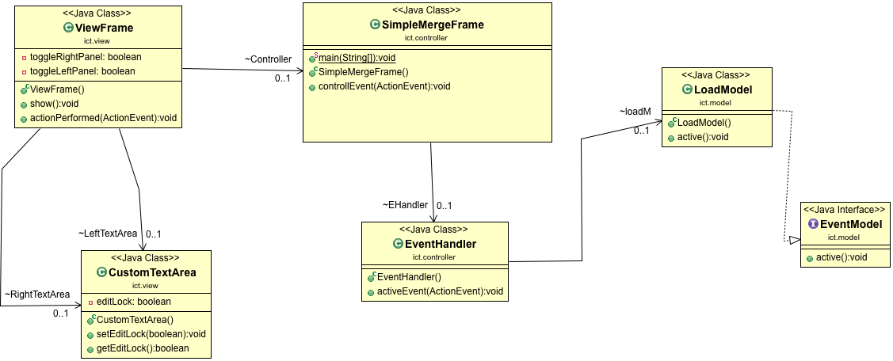

# Class Diagram V 1.0

전체적인 흐름을 잡아봤습니다

## MVC 패턴

- Model : LoadModel.java
    - 하나만 만들어 봤으며 EventModel Interface 를 통해 LoadModel을 구현했습니다.
- View : ViewFrame.java
    - JTextArea 만으로는 부족한 것 같아서 상속받는 클래스를 하나 만들어봤습니다.( CustomTextArea )
    
- Controller : SimpleMergeFrame.java
    - main 함수가 있는곳
        - view와 model을 이곳에서 컨트롤 합니다.
        - view -> model 을 지양하고 , controll 에서 precondition등을 확인 한 뒤 결과들을 주고 받으면 될 것 같습니다.

### 이러한 느낌이 MVC 패턴인 것 같아서 다이어그램으로 그려봤습니다.

- 굳이 이대로 진행할 필요도 없으며 , 초반이라서 이러한 흐름이 어떻냐고 제안하는 과정임을 알려드립니다.
- 해당 java 프로젝트는 project name을 변경한 관계로 실행되지 않을 수 있습니다.

## Architecture
- ict
    - controller
        - SimpleMergeFrame
        - EventHandler
    - model
        - LoadModel
        - EventModel( inf )
    - view 
        - ViewFrame
        - CustomTextArea